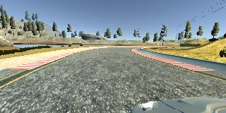

# **Use Deep Learning to Clone Driving Behavior** 

**Behavioral Cloning Project**

The goals / steps of this project are the following:
* Use the simulator to collect data of good driving behavior
* Build, a convolution neural network in Keras that predicts steering angles from images
* Train and validate the model with a training and validation set
* Test that the model successfully drives around track one without leaving the road

## Required Files

###  Submission includes all required files and can be used to run the simulator in autonomous mode

My project includes the following files:
* model.py containing the script to create and train the model
* drive.py for driving the car in autonomous mode
* model.h5 containing a trained convolution neural network 
* writeup.pdf summarizing the results

## Quality of Code

Using the Udacity provided simulator and my drive.py file, the car can be driven autonomously around the track by executing 


```python
python drive.py model.h5
```

The code in model.py is organized and includes comments for ease of use. 

## Model Architecture and Training Strategy

My model is based on NVIDIA architecture with a minor changes, consistings of a convolution neural network with 5x5 filter sizes and depths between 6 and 16 including  RELU layers to introduce nonlinearity , and the data is normalized in the model using a Keras lambda layer.


The model was trained and validated on different data sets (model.py line20) to ensure that the model was not overfitting. 
The model used an adam optimizer, so the learning rate was not tuned manually.

## Architecture and Training Documentation

Training data was chosen to keep the vehicle driving on the road. I used a combination of
* center lane driving clockwise
* center lane driving clockcounterwise
* recovery from sides
* aditional curves

The overall strategy for deriving a model architecture was to able to predict steering angle given a road image.

My first step was to use a convolution neural network model similar to the NVIDIA which includes max pooling layers and convolution layers that uses 'relu' as the activation function.

In order to gauge how well the model was working, I split my image and steering angle data into a training and validation set.

The final step was to run the simulator to see how well the car was driving around track one. 
There were a few spots where the vehicle fell off the track faling into the water and going out of track to improve the driving behavior in these cases, I modified the angle for the aditional camera images so a compensation could help to avoid the car to go off track.

At the end of the process, the vehicle is able to drive autonomously around the track without leaving the road.


### Final Model Architecture

based on NVIDIA Architecture
* Input : Convolutional. accepts a 160,320,3 as shape input
* Cropping we crop the image 70 from the top and 25 px from the bottom in order to reduce noise
* Layer 1: Convolutional. 1 subsample 2,2 and stride, 24,5,5.
* Activation relu. computes rectified linear.
* Layer 2: Convolutional. 1 subsample 2,2 and stride, 36,5,5.
* Activation relu. computes rectified linear.
* Layer 3: Convolutional. 1 subsample 2,2 and stride, 48,5,5.
* Activation relu. computes rectified linear.
* Layer 4: Convolutional. 1 stride, 64,5,5.
* Layer 5: Convolutional. 1 stride, 64,5,5.
* Flatten. Flatten the output shape of the final pooling layer such that it's 1D instead of 3D.
* Dense:  100 outputs.
* Dense:  50 outputs.
* Dense:  10 outputs.
* Dense:  1 Return the result of the last fully connected layer.

Total params: 348,219
Trainable params: 348,219
Non-trainable params: 0


To capture good driving behavior, I first recorded two laps on track one using center lane driving. Here is an example image of center lane driving:


I then recorded the vehicle recovering from the left side and right sides of the road back to center so that the vehicle would learn to recover from going off track,  These images show what a recovery looks like starting from ... :


Then I repeated this process on track two in order to get more data points.

To augment the data sat, I also flipped images and angles thinking that this would include more samples without having to collect them and with more data a better accuracy. 
Here is an image that has then been flipped:




After the driving collection process, I had 25815 data points I then preprocessed this data by adjusting it so it could adjust to the expected samples per epoch to work with 25792 data points, the I set 80% ( 20633 ) and 20% of those samples into a training set and validation set. and after fliping image and inlcuding side cameras i end up 123,798 images , so in order to process that quanity of images i used generator method to deal with the large amount of data and avoid memory issues, then normaliation and cropping the image was incldued to remove noise and fous training on the road, 4epochs seems to do the job.
I used an adam optimizer so that manually training the learning rate wasn't necessary.


